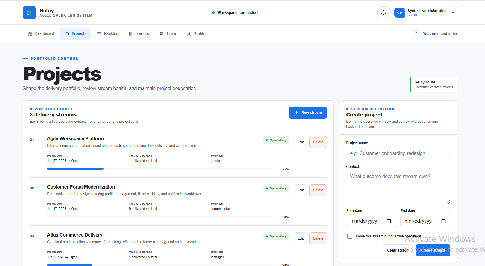
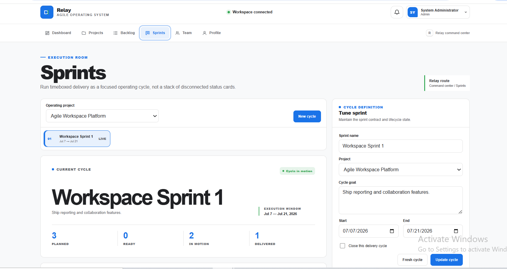
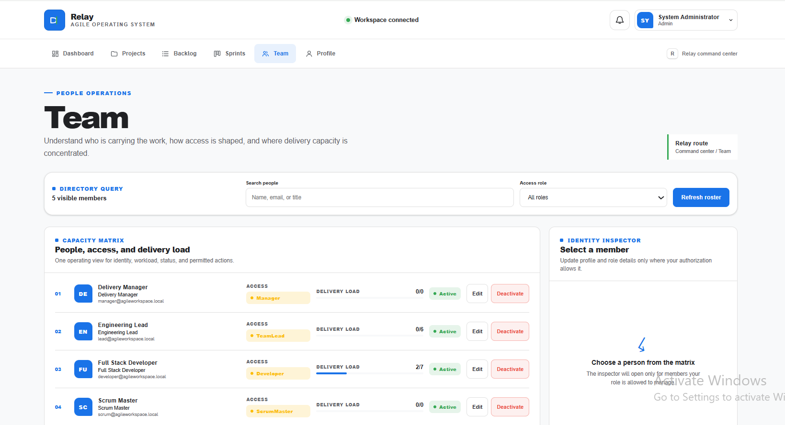

# Agile Workspace

A full-stack portfolio application for project planning, sprint execution, backlog management, team administration, notifications, and delivery reporting, with supporting backend APIs for daily updates and GitHub issue import.

**Developer: Muhammad Ali Nawaz**



## Project overview

Agile Workspace combines an ASP.NET Core 9 Web API, Angular 21 client, and SQL Server 2022 database. The application uses a pragmatic controller/service/EF Core structure with centralized authorization, safer JWT lifecycle handling, transactional work-item changes, validated GitHub issue import, optimistic concurrency, health checks, automated tests, and deployment configuration.

The repository is intended as a practical portfolio project. Production deployment still requires an operator to supply secrets, HTTPS termination, backups, monitoring, and environment-specific infrastructure.

## Fully implemented features

- Developer-only public self-registration and ASP.NET Core Identity sign-in.
- Admin, ScrumMaster, Manager, TeamLead, and Developer roles with a centralized hierarchy.
- Profile management and password changes using the same 10-character complexity policy as the API.
- Project and sprint management with validation and optimistic concurrency.
- Backlog work-item creation, filtering, comments, activity history, and role-aware editing.
- Developers may update content and status only on work items they created or are assigned; planning and assignment fields require delivery leadership.
- Team administration with hierarchy enforcement and phone-number preservation.
- Dashboard/reporting queries, limited notification dropdowns, accurate notification totals, and per-user isolation.
- SQL Server/API health checks, Docker Compose, Nginx reverse proxying, CI configuration, and focused automated tests.
- Responsive Angular interface with dark mode and local/system assets.

## Backend-supported or partially implemented capabilities

- SignalR includes authenticated server hubs and post-commit broadcasts, but the Angular client does not establish a live hub connection.
- Daily-update endpoints enforce project access, sprint relationships, uniqueness, and batched notifications; there is no dedicated Angular daily-update page.
- GitHub issue import supports pagination, pull-request exclusion, duplicate prevention, safe external HTTP handling, and transactions; there is no dedicated Angular import page.
- Notifications are displayed in the dashboard/header and can be marked read, but there is no full notification-centre page or realtime Angular refresh.
- Parent-task, recurring-task, subtask, and attachment domain fields/models exist, but the Angular application does not provide complete management, upload, or download workflows for them.

## Known limitations

- Authentication uses short-lived JWT bearer tokens stored in `sessionStorage`; the application has no refresh-token, MFA, email-verification, forgot-password, or server-side logout-revocation workflow. Logout primarily removes the browser token.
- Security-stamp validation queries the database on authenticated requests so role, password, and active-status changes invalidate old tokens; this improves safety but adds database cost.
- The schema does not store a work-item creation timestamp. Burndown output therefore uses current project scope and real completion timestamps; it does not fabricate historical scope.
- The repository is portfolio-ready after local verification, not a claim of production-ready SaaS. A real deployment still needs HTTPS termination, backups, monitoring, operational secret management, database maintenance, and environment-specific review.
- Local verification requires the prerequisites below. Never interpret source review alone as proof that an environment-specific deployment is operational.

## Technology stack

| Area | Technology |
|---|---|
| Backend | .NET 9.0.18, ASP.NET Core Web API |
| Authentication | ASP.NET Core Identity, JWT bearer authentication |
| Data | Entity Framework Core 9.0.18, SQL Server 2022 |
| Frontend | Angular 21, TypeScript 5.9, RxJS, SCSS |
| Charts | ApexCharts |
| Realtime | ASP.NET Core SignalR |
| API documentation | Swagger/OpenAPI |
| Containers | Docker Compose, Nginx, official .NET/Node/SQL Server images |
| Tests | xUnit, ASP.NET Core test host, SQLite/InMemory EF providers, SQL Server row-version integration test, Angular TestBed/Vitest, Node contract/policy checks |

## Architecture

The solution intentionally remains a straightforward monolithic application suitable for a Junior ASP.NET interview:

1. Angular pages call typed frontend services.
2. Controllers handle HTTP routing, authentication context, model binding, and response envelopes.
3. Existing services contain reusable business rules, authorization, validation, and transaction boundaries.
4. EF Core `ApplicationDbContext` is the primary persistence unit for writes and multi-entity transactions.
5. A focused `TaskRepository` remains for the reusable, include-heavy work-item read queries; redundant project repository and custom Unit of Work wrappers were removed.
6. SignalR broadcasts occur only after successful database commits and failures are logged without undoing committed changes.

Sprint and daily-update controllers delegate to focused services, so controllers contain HTTP concerns rather than EF Core queries or transaction logic. The project still avoids forcing every EF Core query through a generic repository.

The project is not a microservice, CQRS, event-sourced, DDD, or Clean Architecture rewrite.

## Folder structure

```text
Agile-Workspace/
├── AgileWorkspace.sln
├── backend/
│   ├── api/                 # ASP.NET Core API and EF migrations
│   └── api.Tests/           # Backend security/integrity tests
├── frontend/                # Angular application and Nginx image
├── docs/screenshots/        # Sanitized application screenshots
├── .github/                 # CI, Dependabot, and templates
├── docker-compose.yml
├── .env.example
├── SECURITY.md
└── LICENSE
```

## Role and permission matrix

The API is authoritative. Hiding a frontend control is never the only authorization measure.

| Capability | Admin | ScrumMaster | Manager | TeamLead | Developer |
|---|:---:|:---:|:---:|:---:|:---:|
| Public self-registration result | Developer | Developer | Developer | Developer | Developer |
| View accessible projects/work items | Yes | Yes | Yes | Yes | Assigned/created/participating only |
| Create/update projects | Yes | Yes | Yes | No | No |
| Delete projects | Yes | No | No | No | No |
| Create/update sprints | Yes | Yes | Yes | No | No |
| Create work items | Yes | Yes | Yes | Yes | No |
| Update work-item content/status | Yes | Yes | Yes | Yes | Assigned/created only |
| Change assignment, sprint, parent, recurrence, type, priority, estimate, or schedule | Yes | Yes | Yes | Yes | No |
| Delete work items | Yes | Yes | Yes | No | No |
| View team directory | Yes | Yes | Yes | Yes | No |
| Assign Admin role | Yes | No | No | No | No |
| Manage a peer/higher role | Admin rules | No | No | No | No |
| Change own role/status | No | No | No | No | No |
| Submit daily updates | Yes | Yes | Yes | Yes | Yes for accessible projects |

## Authentication overview

ASP.NET Core Identity stores users, password hashes, lockout state, roles, and security stamps. Login issues a configurable short-lived JWT after password and lockout checks. The API validates issuer, audience, signature, lifetime, account activity, and the current security stamp on authenticated requests. Public registration always creates a Developer account; privileged users are created or assigned through authorized management operations only.

The Angular client stores the token in `sessionStorage` and attaches it only to the configured API origin. This is suitable for the current portfolio architecture but is not described as fully production-grade authentication; the limitations are listed above.

## Prerequisites

- Windows 10/11, Linux, or macOS.
- .NET SDK 9.0.316. The committed `global.json` selects the current .NET 9 servicing SDK.
- Node.js 22.12 or later in the supported Angular range and npm 10 or later.
- SQL Server 2022 or a compatible SQL Server instance.
- EF Core CLI: run `dotnet tool restore` from the repository root to restore the pinned 9.0.18 tool.
- Optional: Docker Desktop with Docker Compose v2.

## Default ports

| Service | Default local address |
|---|---|
| Angular development server | `http://localhost:4200` |
| ASP.NET Core HTTP profile | `http://localhost:5167` |
| ASP.NET Core HTTPS profile | `https://localhost:7283` |
| Docker/Nginx application | `http://localhost:4200` |
| SQL Server in Docker | Internal network only by default |

## Secure configuration

Tracked files contain no deployable passwords or signing keys. Configure these values externally:

- `ConnectionStrings:DefaultConnection`
- `JWT:SigningKey` with at least 32 random bytes
- optional `GitHub:PersonalAccessToken`
- development-only demo passwords when demo seeding is explicitly enabled
- `Database:ApplyMigrationsOnStartup` for explicit startup migration behaviour
- `AuditLogging:*` controls for audit enablement, payload capture, retention days, and cleanup interval
- `ForwardedHeaders:*` controls; disabled by default and enabled only with explicitly trusted proxy IP addresses

Environment-variable equivalents use double underscores, for example `JWT__SigningKey`.

Do not commit `.env`, exported user secrets, connection strings, access tokens, or real credentials. Copy `.env.example` to `.env` only on the local machine running Docker.

## .NET user secrets

From `backend\api`, initialize user secrets and provide local values:

```cmd
dotnet user-secrets init
dotnet user-secrets set "ConnectionStrings:DefaultConnection" "Server=localhost,1433;Database=AgileWorkspaceDb;User Id=sa;Password=<YOUR_LOCAL_SQL_PASSWORD>;Encrypt=True;TrustServerCertificate=True;MultipleActiveResultSets=true"
dotnet user-secrets set "JWT:SigningKey" "<AT_LEAST_32_RANDOM_BYTES>"
dotnet user-secrets set "JWT:Issuer" "AgileWorkspace.Api"
dotnet user-secrets set "JWT:Audience" "AgileWorkspace.Client"
```

For optional GitHub authentication:

```cmd
dotnet user-secrets set "GitHub:PersonalAccessToken" "<YOUR_GITHUB_TOKEN>"
```

## SQL Server and EF Core migrations

Automatic migrations are controlled by `Database:ApplyMigrationsOnStartup`. The safe tracked default is `false`; Development configuration and the portfolio Docker Compose file explicitly enable it. When enabled, a required migration failure stops startup and the API never reports healthy against an unknown schema.

```cmd
cd backend\api
dotnet tool restore
dotnet restore
dotnet ef migrations list
dotnet ef database update
```

The hardening migration adds:

- safe cleanup of older duplicate daily updates (retaining the newest record) before creating the unique `(ProjectId, UserId, UpdateDate)` index;
- SQL Server row-version columns for projects, sprints, and work items;
- bounded user, audit-log, and recurrence fields.

Back up an existing database before applying migrations. For production-style deployments, leave startup migration disabled and run `dotnet ef database update` as an explicit deployment step.

## Backend development

HTTP launch profile:

```cmd
cd backend\api
dotnet run --launch-profile http
```

HTTPS launch profile:

```cmd
cd backend\api
dotnet dev-certs https --trust
dotnet run --launch-profile https
```

Swagger is available in Development at `/swagger`. Liveness is `/health/live`; SQL readiness is `/health/ready`.

## Frontend development

The frontend reads `public/app-config.js`. Its default `/api` base works with the Angular proxy, Docker same-origin routing, and same-origin production hosting.

For the HTTP API profile:

```cmd
cd frontend
npm ci
npm start
```

For the local HTTPS API profile:

```cmd
cd frontend
npm run start:https-api
```

Do not edit application source to switch environments. Override `window.__AGILE_WORKSPACE_CONFIG__.apiBaseUrl` in the deployed `app-config.js` only when a separate API origin is required.

## Testing

Backend:

```cmd
dotnet test backend\api.Tests\api.Tests.csproj -c Release
```

Frontend non-watch tests:

```cmd
cd frontend
npm ci
npm test
```

The frontend suite has three explicit layers. Angular TestBed/Vitest behavioural tests exercise profile password forms, team editing, the authentication interceptor, the route guard, typed HTTP-service calls, and the numeric work-item API contract. Lightweight policy/source checks protect pure role, password, session, API-origin, and wiring rules. A cross-stack contract test reads both the Angular and C# enum declarations so status and priority values cannot silently diverge. Backend tests cover public registration, privilege-escalation attempts, protected Admin accounts, security-stamp invalidation, developer work-item boundaries, controller/service architecture, trusted forwarded-header configuration, validation, atomic task/activity persistence, daily-update uniqueness, notification totals, sprint-service behaviour, and mocked GitHub responses. CI also starts SQL Server 2022 and verifies that a stale project update raises a real `DbUpdateConcurrencyException` against SQL Server row-version semantics. A complete browser E2E suite is intentionally not included because it would add a separate testing stack beyond this junior-portfolio scope.

## Production builds

```cmd
dotnet publish backend\api\api.csproj -c Release -o artifacts\api
cd frontend
npm ci
npm run build
```

The Angular production build uses local/system fonts and does not depend on downloading Google Fonts or copied Vue bundles.

## Docker Compose

1. Copy `.env.example` to `.env`.
2. Replace every `CHANGE_ME` value with a long local secret.
3. Run:

```cmd
docker compose config
docker compose build --no-cache
docker compose up -d
docker compose ps
```

Open `http://localhost:4200`. SQL Server is internal to the Compose network by default. Use `docker-compose.override.example.yml` only when a local host SQL port is genuinely required.

The Nginx container proxies `/api` and `/hubs`, preserves Angular routes, supports WebSocket upgrades, and sends CSP, MIME-sniffing, referrer, permissions, and frame-ancestor protections. Forwarded headers are disabled for direct API hosting and enabled in Compose only for the fixed, private Nginx proxy address. Do not copy that trust setting to a public network. HSTS is intentionally not sent by the HTTP-only local container; add it only at a correctly configured HTTPS terminator.

## Optional development demo data

Demo users are disabled by default and are allowed only in the `Development` environment. Enabling demo data without providing every required password causes startup to fail rather than falling back to a predictable password.

```cmd
dotnet user-secrets set "Seed:EnableDemoData" "true"
dotnet user-secrets set "Seed:Users:Admin:Password" "<LOCAL_DEMO_ADMIN_PASSWORD>"
dotnet user-secrets set "Seed:Users:ScrumMaster:Password" "<LOCAL_DEMO_SCRUMMASTER_PASSWORD>"
dotnet user-secrets set "Seed:Users:Manager:Password" "<LOCAL_DEMO_MANAGER_PASSWORD>"
dotnet user-secrets set "Seed:Users:TeamLead:Password" "<LOCAL_DEMO_TEAMLEAD_PASSWORD>"
dotnet user-secrets set "Seed:Users:Developer:Password" "<LOCAL_DEMO_DEVELOPER_PASSWORD>"
```

Never use demo accounts in production, publish their passwords, or set `Seed__EnableDemoData=true` in production containers.

## Security notes

- Public registration has no role property and always assigns Developer.
- Managed account creation and role changes use the centralized hierarchy.
- Only Admin can assign Admin; self-promotion and self-deactivation are blocked.
- JWT lifetime is configurable and bounded to 5–240 minutes.
- Every authenticated request checks account existence, active state, and security stamp.
- Nginx access logging is disabled for the SignalR route because WebSocket clients may transmit the bearer token in the standard `access_token` query parameter.
- Password, role, and status changes update the security stamp and invalidate older tokens.
- Developers cannot read or modify another user’s work item by guessing its ID. On their assigned/created work items, they may change content and status but not assignment, sprint, parent, recurrence, type, priority, estimate, or schedule fields.
- Work-item changes and required activity entries commit in one transaction.
- Persistence completes before realtime broadcasts; broadcast failure does not misreport a committed database change as rolled back.
- “Due this week” uses a documented Monday 00:00 UTC inclusive to next Monday 00:00 UTC exclusive boundary.
- API audit logging is configuration-controlled, redacts sensitive fields, omits authentication payloads/files, truncates requests, excludes low-value paths, and does not capture response bodies by default. A small hosted service consumes `AuditLogging:RetentionDays` and `CleanupIntervalHours` dynamically; the SQL script remains a variable-driven manual fallback.
- See [SECURITY.md](SECURITY.md) for vulnerability reporting and secret-handling guidance.

## Audit-log retention

Audit logging is enabled by default for controller actions, while response-body capture is disabled. `AuditLogRetentionService` reads `AuditLogging:RetentionCleanupEnabled`, `RetentionDays`, and `CleanupIntervalHours` through reloadable .NET options and safely deletes expired API/error logs without failing business requests. The reviewed `docs/sql/purge-old-audit-logs.sql` script is retained as a manual fallback and accepts a SQLCMD value, for example `sqlcmd ... -i docs\sql\purge-old-audit-logs.sql -v RetentionDays=45`.

## Screenshots

The committed screenshots show application pages only. Credential-bearing sign-in captures, empty dashboard panels, operating-system watermarks, browser status bars, and local-machine chrome are intentionally excluded.

| Projects | Backlog |
|---|---|
|  |  |

| Sprints | Team |
|---|---|
|  |  |

| Profile |
|---|
|  |

## Contract and release verification

Work-item status and priority are serialized as numeric enums. Angular and ASP.NET use the same explicit values (`1` through `4`). Both frontend and backend test projects contain cross-stack contract checks that fail when either declaration changes without the other.

Create a clean portfolio archive from Windows PowerShell with:

```cmd
powershell -NoProfile -ExecutionPolicy Bypass -File scripts\package-portfolio.ps1
```

The script includes dot-directories such as `.github`, rejects missing CI, Dependabot, issue-template, or pull-request-template files, and excludes generated dependencies, build output, secrets, logs, and existing ZIP files.

## Troubleshooting

**API exits because configuration is missing**  
Set the connection string and JWT signing key through user secrets or environment variables. Empty tracked placeholders are intentional.

**`dotnet ef` is not recognized**  
Run `dotnet tool restore` from the repository root. The tool manifest pins `dotnet-ef` 9.0.18.

**SQL readiness is unhealthy**  
Check SQL Server startup, credentials, TLS/trust settings, database permissions, and the API connection string. If startup migrations are disabled, apply migrations manually before expecting readiness to succeed.

**Angular cannot reach the API**  
Use `npm start` for the HTTP launch profile or `npm run start:https-api` for port 7283. Verify `public/app-config.js` and the matching proxy file.

**`npm ci` reports lock-file mismatch**  
Use the committed `package.json` and `package-lock.json` together. Do not use `npm install` inside the production Docker build.

**A write returns HTTP 409**  
Reload the record and reapply the change. Another request changed the row version, or a unique/business constraint was reached.

## Complete Windows Command Prompt sequences

Run these from the extracted project root. Replace angle-bracket placeholders locally; do not commit the resulting secrets.

### 1. Restore and build the backend

```cmd
cd /d "%CD%"
dotnet restore AgileWorkspace.sln
dotnet build AgileWorkspace.sln -c Release --no-restore
```

### 2. Configure .NET user secrets

```cmd
cd backend\api
dotnet user-secrets init
dotnet user-secrets set "ConnectionStrings:DefaultConnection" "Server=localhost,1433;Database=AgileWorkspaceDb;User Id=sa;Password=<YOUR_LOCAL_SQL_PASSWORD>;Encrypt=True;TrustServerCertificate=True;MultipleActiveResultSets=true"
dotnet user-secrets set "JWT:SigningKey" "<AT_LEAST_32_RANDOM_BYTES>"
dotnet user-secrets set "JWT:Issuer" "AgileWorkspace.Api"
dotnet user-secrets set "JWT:Audience" "AgileWorkspace.Client"
cd ..\..
```

### 3. Create or update the SQL Server database

```cmd
cd backend\api
dotnet tool update --global dotnet-ef --version 9.*
dotnet ef database update
cd ..\..
```

### 4. List and apply EF Core migrations

```cmd
cd backend\api
dotnet ef migrations list
dotnet ef database update
cd ..\..
```

### 5. Run the API with HTTP

```cmd
cd backend\api
dotnet run --launch-profile http
```

### 6. Run the API with HTTPS

```cmd
cd backend\api
dotnet dev-certs https --trust
dotnet run --launch-profile https
```

### 7. Install frontend dependencies

```cmd
cd frontend
npm ci
cd ..
```

### 8. Run the Angular development server

```cmd
cd frontend
npm start
```

### 9. Run frontend tests

```cmd
cd frontend
npm test
cd ..
```

### 10. Create a production frontend build

```cmd
cd frontend
npm ci
npm run build
cd ..
```

### 11. Run backend tests

```cmd
dotnet test backend\api.Tests\api.Tests.csproj -c Release
```

### 12. Run the complete solution with Docker Compose

```cmd
copy /Y .env.example .env
notepad .env
docker compose config
docker compose build --no-cache
docker compose up -d
docker compose ps
```

### 13. Stop and clean Docker resources

```cmd
docker compose down
docker compose down -v --remove-orphans
```

The second command deletes the local SQL Server volume and its data.

### 14. Verify health endpoints

```cmd
curl.exe -f http://localhost:5167/health/live
curl.exe -f http://localhost:5167/health/ready
curl.exe -f http://localhost:4200/health
```

### 15. Create a clean Git repository commit

```cmd
for /d /r %D in (bin,obj,node_modules,dist,.angular) do @if exist "%D" rd /s /q "%D"
del /s /q *.user *.suo *.log 2>nul
git init
git add .
git status --short
git commit -m "Repair and harden Agile Workspace"
```

Review `git status` before committing and confirm that `.env`, secrets, generated binaries, and caches are not staged.

## Resume-friendly project summary

**Agile Workspace** — Built and hardened a full-stack agile project-management application using ASP.NET Core 9, Angular 21, EF Core, SQL Server, Identity/JWT authentication, role and resource authorization, transactional activity logging, optimistic concurrency, reporting, Docker Compose, health checks, and automated security/integrity tests.

## License

This project is licensed under the MIT License. Copyright (c) 2026 Muhammad Ali Nawaz.

Third-party components remain subject to their own licenses and notices. The project does not claim original authorship of third-party TailAdmin-inspired design assets or libraries.
