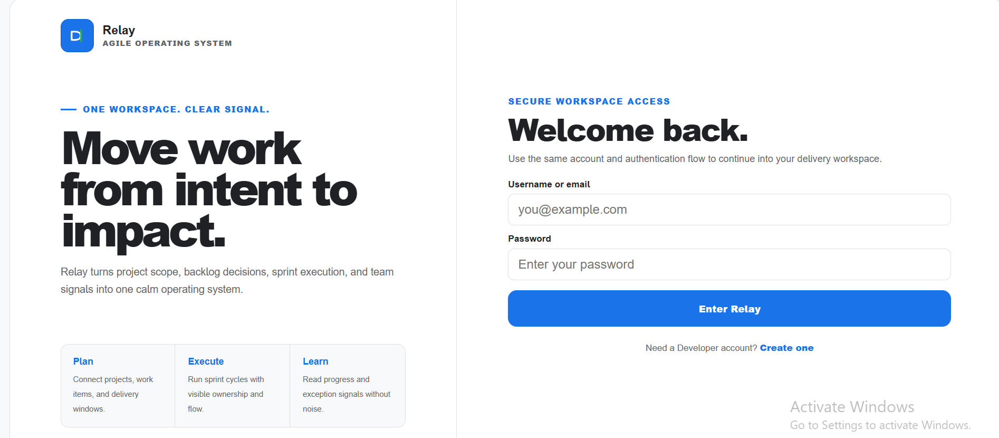
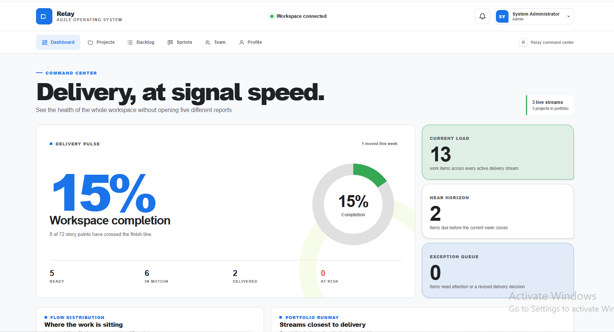
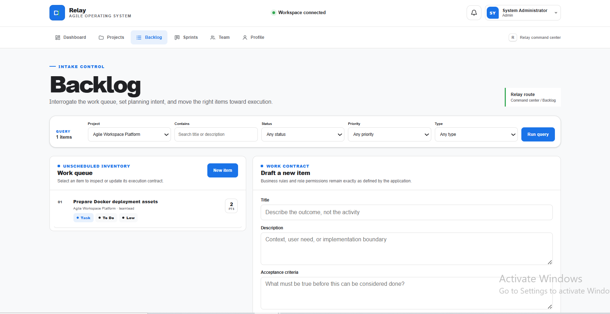
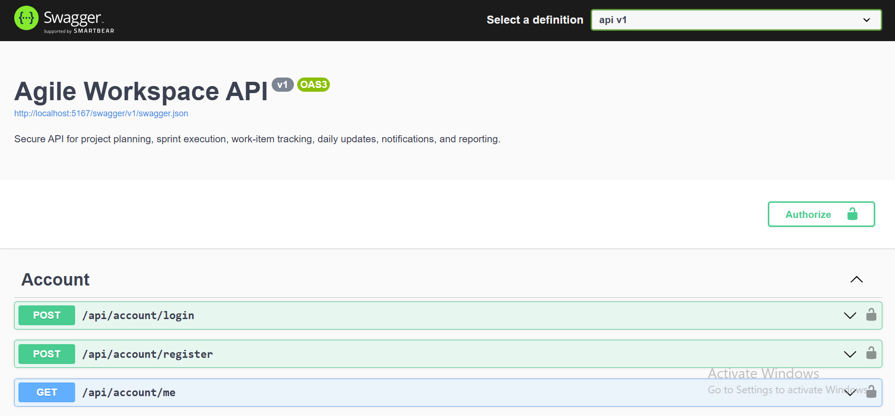

<h1 align="center">📋 Agile Workspace</h1>

<p align="center">
  <b>A secure, responsive full-stack agile project-management platform built with ASP.NET Core 9 Web API, Angular 21, TypeScript 5.9, Entity Framework Core, SQL Server, Identity/JWT authentication, SignalR, SCSS, and Docker Compose.</b>
</p>

<p align="center">
  
  
  
  
  
  
  
  
</p>

---

## 📸 Project Screenshots

| Sign In | Dashboard |
|---|---|
|  |  |

| Projects | Backlog |
|---|---|
|  |  |

| Sprints | Team |
|---|---|
|  |  |

| Swagger API Documentation |
|---|
|  |

### Screenshot Files

```text
docs/screenshots/
├── api.png
├── backlogs.png
├── dashboard.png
├── projects.png
├── signin.png
├── sprints.png
└── team.png
```

---

## 🚀 Project Overview

**Agile Workspace** is a full-stack agile delivery and project-management application for organizing projects, planning sprints, managing backlog work items, collaborating with teams, tracking notifications, and reviewing delivery performance.

The application combines an **Angular 21 standalone frontend** with an **ASP.NET Core 9 Web API**, **Entity Framework Core 9**, **SQL Server 2022**, **ASP.NET Core Identity**, and **JWT bearer authentication**. It provides a role-aware workspace for administrators, Scrum Masters, managers, team leads, and developers while keeping authorization enforcement inside the API.

The frontend uses a clean **Google Workspace-inspired design system** with white surfaces, light-gray backgrounds, Google Blue primary actions, accessible status colors, responsive navigation, and Angular-native SVG/CSS data visualizations. The project is designed as a strong junior full-stack ASP.NET portfolio application without pretending to be a production SaaS deployment.

---

## 🎯 Project Purpose

Agile teams need one workspace where project context, sprint planning, work-item status, team access, and delivery reporting remain connected. This project demonstrates how those workflows can be implemented using a modern Angular client and a secure ASP.NET Core API.

**Agile Workspace** is intended to showcase practical skills in:

- ASP.NET Core Web API development
- Angular standalone application development
- Entity Framework Core and SQL Server persistence
- ASP.NET Core Identity and JWT authentication
- Role-based and resource-based authorization
- REST API design and typed frontend services
- Responsive enterprise dashboard design
- Validation, error handling, concurrency, transactions, and testing
- Docker Compose deployment with Nginx and SQL Server

---

## 🎯 Key Highlights

- 📊 Delivery dashboard with project, task, sprint, activity, and productivity reporting
- 📁 Project portfolio management with role-aware create, update, and delete actions
- 🗂️ Backlog search, filtering, work-item creation, editing, deletion, and comments
- 🏃 Sprint planning and execution with burndown information
- 👥 Team directory and account administration with role hierarchy enforcement
- 🔐 ASP.NET Core Identity with secure password hashing and account lockout
- 🎫 Short-lived JWT bearer authentication with issuer, audience, signature, lifetime, active-account, and security-stamp validation
- 🛡️ Server-enforced role and resource authorization
- 🔔 User-isolated notifications with read and read-all operations
- 👤 Profile editing and password-change workflows
- 🧾 API and error audit logging with configurable retention cleanup
- 🔄 EF Core transactions for multi-entity work-item operations
- ⚔️ Optimistic concurrency support for conflicting updates
- 📡 Authenticated SignalR task collaboration hub
- 🐙 GitHub issue import service with pagination and duplicate prevention
- 💓 Liveness and SQL Server readiness health checks
- 📘 Swagger/OpenAPI documentation with bearer-token support
- 🎨 Google Workspace-inspired responsive interface
- 📱 Purpose-built mobile, tablet, laptop, and desktop layouts
- 🧪 Backend xUnit and frontend Vitest/contract tests
- 🐳 Full Docker Compose stack with Angular/Nginx, ASP.NET Core, and SQL Server
- 🔑 No deployable credentials committed to source control

---

## ✨ Features

### 📊 Dashboard & Reporting

| Feature | Description |
|---|---|
| Delivery Overview | Summarizes project, sprint, work-item, and team signals |
| Project Reporting | Returns reporting data for accessible projects |
| Burndown Reporting | Provides project-specific sprint burndown information |
| Productivity Reporting | Exposes leadership-authorized user productivity information |
| Activity Feed | Displays recent authorized delivery activity |
| Responsive Charts | Uses lightweight Angular-native SVG/CSS visualizations without a third-party chart runtime |
| Empty & Error States | Handles missing, delayed, or failed API data safely |

---

### 📁 Project Management

| Feature | Description |
|---|---|
| Project List | Displays projects available to the authenticated user |
| Project Details | Retrieves a project by identifier with authorization checks |
| Create Project | Available to Admin, ScrumMaster, and Manager roles |
| Update Project | Available to Admin, ScrumMaster, and Manager roles |
| Delete Project | Restricted to Admin |
| Validation | Enforces required fields and domain rules in the API |
| Concurrency | Protects supported updates from stale-write conflicts |

---

### 🗂️ Backlog & Work Items

| Feature | Description |
|---|---|
| Work-Item List | Loads authorized work items with project and sprint context |
| Search & Filtering | Filters backlog data without changing backend contracts |
| Create Work Item | Available to delivery-leadership roles |
| Update Work Item | Applies role and ownership restrictions to editable fields |
| Delete Work Item | Restricted to authorized leadership roles |
| Comments | Adds discussion comments to accessible work items |
| Activity History | Records required changes together with the main transaction |
| Assignment Rules | Prevents developers from changing protected planning and assignment fields |
| Transaction Safety | Commits work-item changes and mandatory activity entries atomically |

---

### 🏃 Sprint Management

| Feature | Description |
|---|---|
| Sprint List | Loads sprints with optional project filtering |
| Sprint Creation | Available to Admin, ScrumMaster, and Manager |
| Sprint Updates | Preserves project relationships and validation |
| Work Allocation | Connects backlog work items with sprint execution |
| Burndown View | Visualizes sprint progress using API reporting data |
| Conflict Handling | Returns clear responses when concurrent changes conflict |

---

### 👥 Team & Role Management

| Feature | Description |
|---|---|
| Team Directory | Available to Admin, ScrumMaster, Manager, and TeamLead |
| User Creation | Creates managed accounts through authorized API operations |
| User Editing | Updates profile details while preserving protected identity information |
| Role Assignment | Enforces a centralized role hierarchy |
| Account Status | Supports authorized activation and deactivation |
| Self-Protection | Blocks users from changing their own role or active status |
| Admin Protection | Only Admin can assign the Admin role |

---

### 🔐 Authentication & Profile

| Feature | Description |
|---|---|
| Public Registration | Creates Developer accounts only |
| Login | Uses ASP.NET Core Identity password and lockout checks |
| JWT Authentication | Issues a configurable short-lived bearer token |
| Protected Routes | Angular guard blocks unauthenticated workspace routes |
| Auth Interceptor | Attaches the token only to the configured API origin |
| Session Scope | Stores the token in browser `sessionStorage` |
| Current User | Retrieves the authenticated user's account context |
| Profile Update | Updates the current user's profile |
| Password Change | Uses the same API-enforced password policy as registration |
| Logout | Removes the current browser session token |

---

### 🔔 Notifications & Collaboration

| Feature | Description |
|---|---|
| Notification List | Returns notifications belonging to the current user |
| Mark as Read | Marks a selected notification as read |
| Mark All as Read | Updates all unread notifications for the current user |
| SignalR Hub | Provides authenticated project-channel membership |
| Post-Commit Broadcasts | Sends collaboration events only after persistence succeeds |
| Daily Updates API | Supports project-aware daily update submissions |
| GitHub Import API | Imports GitHub issues for authorized delivery roles |

> The backend SignalR, daily-update, and GitHub-import capabilities exist, but the current Angular application does not yet provide complete dedicated interfaces for every one of those backend features.

---

## 🎨 Google Workspace-Inspired UI/UX

| Design Area | Implementation |
|---|---|
| Main Background | White `#FFFFFF` |
| Secondary Background | Light gray `#F8F9FA` |
| Cards | White surfaces with restrained borders |
| Borders | Neutral gray `#E0E0E0` |
| Primary Actions | Google Blue `#1A73E8` |
| Success | Google Green `#34A853` |
| Warning | Google Yellow `#FBBC04` |
| Error | Google Red `#EA4335` |
| Primary Text | Dark gray `#202124` |
| Secondary Text | Gray `#5F6368` |
| Navigation | Desktop command navigation and responsive mobile navigation |
| Data Visualization | Angular-native SVG/CSS charts with safe empty-data handling |
| Accessibility | Visible focus states, semantic controls, readable contrast, and touch-friendly actions |
| Responsiveness | Purpose-built layouts from 320px mobile to wide desktop screens |

---

## 🛠 Tech Stack

| Layer | Technologies |
|---|---|
| Backend | .NET 9, ASP.NET Core Web API, C# |
| Authentication | ASP.NET Core Identity, JWT bearer authentication |
| Authorization | Role-based policies and resource-aware service checks |
| ORM | Entity Framework Core 9.0.18 |
| Database | SQL Server 2022 |
| API Documentation | Swagger / Swashbuckle 6.4 |
| Realtime Backend | ASP.NET Core SignalR |
| Frontend | Angular 21 standalone components |
| Language | TypeScript 5.9 |
| Reactive Library | RxJS 7.8 |
| Forms | Angular reactive forms |
| UI / Styling | SCSS, CSS variables, responsive Grid/Flexbox, native SVG/CSS charts |
| Frontend Testing | Angular TestBed, Vitest 4, jsdom, Node contract/policy tests |
| Backend Testing | xUnit, Moq, ASP.NET Core test host, EF Core InMemory/SQLite, SQL Server concurrency test |
| Containers | Docker, Docker Compose, Nginx, SQL Server 2022 image |
| Tooling | Angular CLI 21, Prettier 3, pinned `dotnet-ef` 9.0.18 |

---

## 🏗 Architecture Overview

The repository contains an Angular single-page application, an ASP.NET Core API, automated test projects, SQL maintenance documentation, and Docker deployment configuration.

```text
Agile-Workspace/
├── .config/
│   └── dotnet-tools.json
├── backend/
│   ├── api/
│   │   ├── Constants/
│   │   ├── Controllers/
│   │   ├── Data/
│   │   ├── Dtos/
│   │   ├── Exceptions/
│   │   ├── Extensions/
│   │   ├── Filters/
│   │   ├── Health/
│   │   ├── Hubs/
│   │   ├── Interfaces/
│   │   ├── Middlewares/
│   │   ├── Migrations/
│   │   ├── Models/
│   │   ├── Options/
│   │   ├── Repositories/
│   │   ├── Services/
│   │   ├── Program.cs
│   │   ├── api.csproj
│   │   └── Dockerfile
│   └── api.Tests/
├── frontend/
│   ├── public/
│   │   ├── app-config.js
│   │   └── agile-workspace-favicon.svg
│   ├── src/
│   │   ├── app/
│   │   │   ├── core/
│   │   │   ├── features/
│   │   │   │   ├── auth/
│   │   │   │   ├── backlog/
│   │   │   │   ├── dashboard/
│   │   │   │   ├── errors/
│   │   │   │   ├── profile/
│   │   │   │   ├── projects/
│   │   │   │   ├── sprints/
│   │   │   │   └── team/
│   │   │   ├── layout/
│   │   │   └── shared/
│   │   ├── index.html
│   │   ├── main.ts
│   │   └── styles.scss
│   ├── tests/
│   ├── angular.json
│   ├── package.json
│   ├── package-lock.json
│   ├── nginx.conf
│   └── Dockerfile
├── docs/
│   ├── screenshots/
│   └── sql/
├── scripts/
├── AgileWorkspace.sln
├── docker-compose.yml
├── .env.example
├── global.json
├── README.md
├── SECURITY.md
└── LICENSE
```

---

## 🧱 Backend Architecture

The backend follows a pragmatic controller/service/EF Core structure suitable for a junior full-stack portfolio project.

| Area | Responsibility |
|---|---|
| Controllers | Define HTTP routes, bind requests, read authentication context, and return API responses |
| Services | Apply business rules, validation, authorization, transactions, and reporting logic |
| Resource Authorization | Verifies project, sprint, work-item, and realtime access |
| Repositories | Supports focused reusable persistence queries where beneficial |
| EF Core DbContext | Persists Identity users, projects, sprints, tasks, comments, activities, notifications, updates, and audit data |
| Identity | Stores users, roles, password hashes, lockout state, and security stamps |
| JWT Service | Creates signed tokens with role and security-stamp claims |
| Middleware & Filters | Handle error logging and request/action auditing |
| Health Checks | Separate process liveness from SQL Server readiness |
| SignalR Hub | Authorizes users before joining project collaboration channels |
| Hosted Service | Removes expired audit and error logs according to configuration |

The project intentionally avoids unnecessary microservice, CQRS, event-sourcing, or generic-repository complexity.

---

## 🗃 Database Areas

| Entity Area | Purpose |
|---|---|
| Identity Users & Roles | Authentication, account status, roles, lockout, and security stamps |
| Projects | Delivery initiatives and project ownership context |
| Sprints | Time-boxed project execution periods |
| Task Items | Backlog and sprint work items |
| Subtasks | Child work-item data model |
| Comments | Work-item collaboration messages |
| Activity Logs | Auditable work-item change history |
| Attachments | Work-item attachment data model |
| Daily Updates | User delivery updates linked to projects and sprints |
| Notifications | Per-user application notifications |
| API Logs | Configurable API audit records |
| Error Logs | Server-side application error records |

---

## 👮 Role & Permission Matrix

The API remains authoritative. Hiding a button in Angular is never the only authorization control.

| Capability | Admin | ScrumMaster | Manager | TeamLead | Developer |
|---|:---:|:---:|:---:|:---:|:---:|
| Register publicly | Developer role | Developer role | Developer role | Developer role | Developer role |
| View accessible projects and work items | ✅ | ✅ | ✅ | ✅ | Assigned/created/participating |
| Create or update projects | ✅ | ✅ | ✅ | ❌ | ❌ |
| Delete projects | ✅ | ❌ | ❌ | ❌ | ❌ |
| Create or update sprints | ✅ | ✅ | ✅ | ❌ | ❌ |
| Create work items | ✅ | ✅ | ✅ | ✅ | ❌ |
| Update work-item content and status | ✅ | ✅ | ✅ | ✅ | Assigned/created only |
| Change protected planning fields | ✅ | ✅ | ✅ | ✅ | ❌ |
| Delete work items | ✅ | ✅ | ✅ | ❌ | ❌ |
| View and manage team users | ✅ | ✅ | ✅ | ✅ | ❌ |
| Assign Admin role | ✅ | ❌ | ❌ | ❌ | ❌ |
| Manage a peer or higher role | Admin rules | ❌ | ❌ | ❌ | ❌ |
| Change own role or active status | ❌ | ❌ | ❌ | ❌ | ❌ |
| Import GitHub issues | ✅ | ✅ | ✅ | ✅ | ❌ |
| Submit daily updates | ✅ | ✅ | ✅ | ✅ | Accessible projects only |

---

## 🔄 Application Flow

### Authentication Flow

```text
User submits sign-in form
        ↓
Angular sends credentials to POST /api/account/login
        ↓
ASP.NET Core Identity validates password and lockout state
        ↓
API creates a short-lived signed JWT
        ↓
Angular stores the token in sessionStorage
        ↓
Auth interceptor attaches the token to API-origin requests
        ↓
API validates issuer, audience, signature, lifetime,
active account, role claims, and current security stamp
        ↓
Protected Angular routes and API resources become available
```

### Project Delivery Flow

```text
Authenticated user opens dashboard
        ↓
Angular typed services request reporting and workspace data
        ↓
API verifies role and resource access
        ↓
Service layer applies business rules and queries EF Core
        ↓
SQL Server returns projects, sprints, tasks, users, and activity
        ↓
API returns typed JSON responses
        ↓
Angular renders responsive views and native visualizations
        ↓
Authorized changes commit with validation, concurrency,
and transactional activity logging
```

### Docker Compose Flow

```text
Browser opens http://localhost:4200
        ↓
Nginx serves the Angular production build
        ↓
Nginx proxies /api and /hubs to ASP.NET Core
        ↓
ASP.NET Core connects to internal SQL Server 2022
        ↓
Readiness health check verifies database connectivity
```

---

## 📡 Frontend Routes

| Route | Access | Purpose |
|---|---|---|
| `/signin` | Public | Authenticate an existing user |
| `/signup` | Public | Register a new Developer account |
| `/dashboard` | Authenticated | Review delivery metrics and activity |
| `/projects` | Authenticated | Browse and manage projects according to role |
| `/backlog` | Authenticated | Search and manage authorized work items |
| `/sprints` | Authenticated | Review and manage sprint execution |
| `/team` | Leadership roles | View and administer team accounts |
| `/profile` | Authenticated | Edit profile details and password |
| `/**` | Any | Display the not-found page |

---

## 🔌 Backend API Endpoints

### Authentication & Profile

| Method & Endpoint | Purpose |
|---|---|
| `POST /api/account/login` | Authenticate and issue a JWT |
| `POST /api/account/register` | Register a Developer account |
| `GET /api/account/me` | Return current account context |
| `GET /api/profile/me` | Return current profile |
| `PUT /api/profile/me` | Update current profile |
| `PUT /api/profile/me/password` | Change current password |

### Projects, Sprints & Work Items

| Method & Endpoint | Purpose |
|---|---|
| `GET /api/projects` | List authorized projects |
| `GET /api/projects/{id}` | Get an authorized project |
| `POST /api/projects` | Create a project |
| `PUT /api/projects/{id}` | Update a project |
| `DELETE /api/projects/{id}` | Delete a project |
| `GET /api/sprints` | List sprints |
| `POST /api/sprints` | Create a sprint |
| `PUT /api/sprints/{id}` | Update a sprint |
| `GET /api/tasks` | List authorized work items |
| `GET /api/tasks/{id}` | Get an authorized work item |
| `POST /api/tasks` | Create a work item |
| `PUT /api/tasks/{id}` | Update a work item |
| `DELETE /api/tasks/{id}` | Delete a work item |
| `POST /api/tasks/{id}/comments` | Add a work-item comment |

### Team, Notifications & Updates

| Method & Endpoint | Purpose |
|---|---|
| `GET /api/users` | List authorized team users |
| `GET /api/users/{id}` | Get a managed user |
| `POST /api/users` | Create a managed user |
| `PUT /api/users/{id}` | Update a managed user |
| `PATCH /api/users/{id}/status` | Activate or deactivate a managed user |
| `GET /api/notifications` | List current-user notifications |
| `POST /api/notifications/{id}/read` | Mark one notification as read |
| `POST /api/notifications/read-all` | Mark all current-user notifications as read |
| `GET /api/daily-updates` | List authorized daily updates |
| `POST /api/daily-updates` | Submit a daily update |
| `POST /api/integrations/github/issues/import` | Import GitHub issues into a project |

### Reporting, Realtime & Health

| Method & Endpoint | Purpose |
|---|---|
| `GET /api/reporting/dashboard` | Return dashboard reporting data |
| `GET /api/reporting/projects` | Return accessible project reporting |
| `GET /api/reporting/projects/{projectId}` | Return one project's report |
| `GET /api/reporting/users/productivity` | Return leadership productivity data |
| `GET /api/reporting/projects/{projectId}/burndown` | Return project burndown data |
| `GET /api/reporting/activity` | Return recent authorized activity |
| `/hubs/tasks` | Authenticated SignalR collaboration hub |
| `GET /health/live` | Confirm process liveness |
| `GET /health/ready` | Confirm application and SQL readiness |

Swagger is available in the Development environment.

---

## 🔐 Security Implementations

| Security Area | Implementation |
|---|---|
| Password Storage | ASP.NET Core Identity password hashing |
| Password Policy | Minimum 10 characters with uppercase, lowercase, digit, and non-alphanumeric requirements |
| Account Lockout | Five failed attempts trigger a 15-minute lockout |
| Registration Role | Public registration always assigns Developer |
| JWT Validation | Issuer, audience, signing key, lifetime, and 30-second clock skew |
| Token Revocation Safety | Active account and current security stamp checked on authenticated requests |
| Role Authorization | Centralized Admin, ScrumMaster, Manager, TeamLead, and Developer hierarchy |
| Resource Authorization | Prevents unauthorized access through guessed project or work-item identifiers |
| CORS | Explicit trusted frontend origins only; wildcard origins are rejected |
| Secrets | Empty tracked placeholders; local values use user secrets or environment variables |
| Validation Responses | Standardized model-validation error responses |
| Concurrency | Supported updates use row-version conflict detection |
| Transactions | Required related writes commit together |
| Audit Logging | Sensitive fields redacted; auth payloads and files omitted |
| Error Logging | Central middleware records server failures without exposing internal details |
| SignalR | Authenticated hub and authorized project-channel membership |
| Nginx | Security headers, Angular fallback, safe API proxying, and disabled hub access logging |
| Containers | API and frontend containers run as non-root users |

> This is a portfolio-grade security implementation, not a substitute for production threat modelling, centralized secret management, HTTPS infrastructure, monitoring, backups, MFA, and incident-response procedures.

---

## ⚡ Performance & Code Quality

- Uses Angular standalone components and lazy route-level component loading
- Uses `OnPush` component defaults for predictable rendering
- Uses typed Angular services and reactive forms
- Uses Angular's modern esbuild-based application builder
- Uses native SVG/CSS charts instead of a heavy chart runtime
- Handles empty, undefined, and delayed chart data safely
- Uses CSS Grid/Flexbox and media queries instead of JavaScript screen detection
- Uses reusable design tokens and a consistent Google Workspace-inspired theme
- Uses API service and domain separation instead of direct HTTP calls inside templates
- Uses asynchronous ASP.NET Core and EF Core APIs
- Uses focused services for authorization, transactions, reporting, notifications, and imports
- Uses database migrations and a pinned EF Core CLI tool manifest
- Uses SQL Server readiness checks separately from process liveness
- Uses multi-stage Docker builds for the API and frontend
- Uses Nginx to serve production Angular files and proxy API/hub traffic
- Uses automated formatting, unit, policy, contract, security, and integrity tests

---

## ⚙️ Installation Guide

### Requirements

- .NET 9 SDK — the repository uses `global.json` with .NET `9.0.100` and latest-feature roll-forward
- Node.js `22.12.0+` recommended; the frontend also supports compatible Node `20.19+` and `24+`
- npm 10+
- SQL Server 2022 or another compatible SQL Server instance
- Git
- Optional: Docker Desktop with Docker Compose v2

---

### 1️⃣ Clone the Repository

```cmd
git clone https://github.com/CodeByMan/agile-workspace.git
cd agile-workspace
```

> Update the GitHub username or repository name if your final repository URL is different.

---

### 2️⃣ Restore Backend Tools and Packages

Run from the repository root:

```cmd
dotnet tool restore
dotnet restore AgileWorkspace.sln
```

The repository pins `dotnet-ef` version `9.0.18` through `.config/dotnet-tools.json`.

---

### 3️⃣ Configure Local Backend Secrets

The backend project already contains a `UserSecretsId`. Run these commands from `backend\api`:

```cmd
cd backend\api

dotnet user-secrets set "ConnectionStrings:DefaultConnection" "Server=localhost,1433;Database=AgileWorkspaceDb;User Id=sa;Password=<YOUR_LOCAL_SQL_PASSWORD>;Encrypt=True;TrustServerCertificate=True;MultipleActiveResultSets=true"

dotnet user-secrets set "JWT:SigningKey" "<AT_LEAST_32_RANDOM_BYTES>"

dotnet user-secrets set "JWT:Issuer" "AgileWorkspace.Api"

dotnet user-secrets set "JWT:Audience" "AgileWorkspace.Client"
```

Do not commit the real SQL password or JWT signing key.

---

### 4️⃣ Create or Update the Database

From `backend\api`:

```cmd
dotnet ef database update
```

Development configuration applies migrations on startup as well, but running the command explicitly makes database setup easier to verify.

---

### 5️⃣ Run the ASP.NET Core API

From `backend\api`:

```cmd
dotnet run --launch-profile http
```

Default API URL:

```text
http://localhost:5167
```

Swagger:

```text
http://localhost:5167/swagger
```

Health endpoints:

```text
http://localhost:5167/health/live
http://localhost:5167/health/ready
```

---

### 6️⃣ Run the Angular Frontend

Open a second Windows CMD window:

```cmd
cd frontend
npm ci
npm start
```

Open:

```text
http://localhost:4200
```

The committed Angular development proxy forwards `/api` requests to the ASP.NET Core HTTP profile on port `5167`.

---

### Clean Frontend Reinstall

Run inside `frontend` after an interrupted or corrupted npm installation:

```cmd
rmdir /s /q node_modules
rmdir /s /q .angular
npm cache verify
npm ci
npm start
```

---

## 🐳 Run the Complete Stack with Docker Compose

### 1. Create local Docker environment values

From the repository root:

```cmd
copy /Y .env.example .env
notepad .env
```

Replace every `CHANGE_ME` value with a strong local secret.

### 2. Build and start the stack

```cmd
docker compose config
docker compose build --no-cache
docker compose up -d
docker compose ps
```

Open:

```text
http://localhost:4200
```

The Docker stack contains:

- Angular production build served by Nginx
- ASP.NET Core API on the internal Docker network
- SQL Server 2022 with a persistent Docker volume

### 3. Stop the stack

```cmd
docker compose down
```

Delete the local SQL Server volume and its data only when intentionally resetting the environment:

```cmd
docker compose down -v --remove-orphans
```

---

## 🏗 Build for Production

### Backend Publish

From the repository root:

```cmd
dotnet publish backend\api\api.csproj -c Release -o artifacts\api
```

Backend output:

```text
artifacts/api/
```

### Frontend Build

```cmd
cd frontend
npm ci
npm run build
```

Angular output:

```text
frontend/dist/agile-workspace/browser/
```

---

## 🧪 Testing

### Backend Tests

From the repository root:

```cmd
dotnet test backend\api.Tests\api.Tests.csproj -c Release
```

The backend test project covers areas including:

- Account and JWT security
- Role hierarchy
- Resource authorization
- User-management authorization
- Work-item validation
- Transaction integrity
- Notification isolation
- Sprint services
- GitHub import mapping and safety
- Model and architecture consistency
- Frontend/backend enum contracts
- SQL Server optimistic concurrency

### Frontend Tests

```cmd
cd frontend
npm test
```

This runs:

```text
Angular component/service/guard/interceptor tests
+
Node security, configuration, password-policy, and enum-contract tests
```

### Formatting & Production Verification

```cmd
cd frontend
npm run format:check
npm run build
```

---

## ✅ Testing Checklist

- [ ] Install .NET 9 SDK, Node.js, npm, and SQL Server
- [ ] Restore the pinned `dotnet-ef` tool
- [ ] Configure connection-string and JWT secrets
- [ ] Apply EF Core migrations
- [ ] Run the ASP.NET Core API
- [ ] Open Swagger at `/swagger`
- [ ] Verify `/health/live`
- [ ] Verify `/health/ready`
- [ ] Install frontend dependencies with `npm ci`
- [ ] Run all frontend tests
- [ ] Run all backend tests
- [ ] Open the Angular application at `http://localhost:4200`
- [ ] Register a Developer account
- [ ] Test valid and invalid sign-in attempts
- [ ] Verify protected-route redirects
- [ ] Test project operations with the correct role
- [ ] Test backlog search, filtering, comments, and authorized CRUD operations
- [ ] Test sprint selection and updates
- [ ] Test team hierarchy restrictions
- [ ] Test profile and password updates
- [ ] Test notification read operations
- [ ] Verify empty and failed API states
- [ ] Test at 320px, 375px, 430px, 768px, 1024px, 1366px, and 1920px widths
- [ ] Confirm there is no horizontal overflow
- [ ] Run the Angular production build
- [ ] Publish the backend in Release mode
- [ ] Build and start the Docker Compose stack

---

## 🔧 Optional Development Demo Data

Demo seeding is disabled by default and is accepted only in the Development environment. Every demo password must be supplied explicitly.

From `backend\api`:

```cmd
dotnet user-secrets set "Seed:EnableDemoData" "true"
dotnet user-secrets set "Seed:Users:Admin:Password" "<LOCAL_DEMO_ADMIN_PASSWORD>"
dotnet user-secrets set "Seed:Users:ScrumMaster:Password" "<LOCAL_DEMO_SCRUMMASTER_PASSWORD>"
dotnet user-secrets set "Seed:Users:Manager:Password" "<LOCAL_DEMO_MANAGER_PASSWORD>"
dotnet user-secrets set "Seed:Users:TeamLead:Password" "<LOCAL_DEMO_TEAMLEAD_PASSWORD>"
dotnet user-secrets set "Seed:Users:Developer:Password" "<LOCAL_DEMO_DEVELOPER_PASSWORD>"
```

Never publish demo passwords or enable demo seeding in production.

---

## 🧹 GitHub Repository Cleanup

Generated folders should not be committed:

```text
backend/**/bin/
backend/**/obj/
frontend/node_modules/
frontend/dist/
frontend/.angular/
.env
*.log
```

Before the first GitHub commit, verify:

```cmd
git status
```

The existing `.gitignore` already excludes these files and local secrets.

---

## 🚀 GitHub Push Commands

Recommended repository name:

```text
agile-workspace
```

From the repository root:

```cmd
git init
git add .
git commit -m "Initial commit: Agile Workspace full-stack application"
git branch -M main
git remote add origin https://github.com/CodeByMan/agile-workspace.git
git push -u origin main
```

If `origin` already exists:

```cmd
git remote set-url origin https://github.com/CodeByMan/agile-workspace.git
git push -u origin main
```

---

## ✅ Recruiter Highlights

This project demonstrates practical junior full-stack ASP.NET development skills, including:

- ✅ ASP.NET Core 9 Web API development
- ✅ Angular 21 standalone frontend development
- ✅ TypeScript 5.9 typed application code
- ✅ Entity Framework Core migrations and SQL Server persistence
- ✅ ASP.NET Core Identity authentication
- ✅ JWT creation and validation
- ✅ Role-based and resource-based authorization
- ✅ Account lockout and security-stamp token invalidation
- ✅ Project, sprint, work-item, comment, notification, and profile workflows
- ✅ Transactional writes and optimistic concurrency
- ✅ Reporting and dashboard APIs
- ✅ SignalR backend collaboration infrastructure
- ✅ GitHub issue import integration
- ✅ Audit/error logging and retention cleanup
- ✅ Swagger/OpenAPI documentation
- ✅ Angular guards, interceptors, reactive forms, and typed services
- ✅ Responsive Google Workspace-inspired UI design
- ✅ Angular-native SVG/CSS data visualization
- ✅ Loading, validation, empty, error, and success states
- ✅ Backend xUnit and frontend Vitest testing
- ✅ Docker Compose with Nginx, API, and SQL Server
- ✅ Health checks and production-oriented container configuration
- ✅ GitHub-ready documentation and secret-safe repository configuration

---

## 📝 Resume-Friendly Project Summary

**Agile Workspace** — Developed a secure full-stack agile project-management platform using ASP.NET Core 9, Angular 21, Entity Framework Core, SQL Server, ASP.NET Core Identity, and JWT authentication. Implemented role/resource authorization, project and sprint planning, backlog workflows, comments, notifications, reporting, transactional activity logging, optimistic concurrency, responsive Google Workspace-inspired UI, automated tests, health checks, Swagger, SignalR backend infrastructure, and Docker Compose deployment.

---

## 🚀 Future Improvements

- 🔄 Connect the Angular client to the existing SignalR task hub for realtime updates
- 📝 Add a dedicated daily-update frontend workflow
- 🐙 Add a dedicated GitHub issue-import interface
- 🔔 Add a complete notification-centre page with realtime refresh
- 📎 Complete attachment upload, download, validation, and storage workflows
- 🧩 Complete parent-task, recurring-task, and subtask management interfaces
- 🔁 Add refresh tokens with server-side revocation
- ✉️ Add email verification and forgot-password workflows
- 🔐 Add optional multi-factor authentication
- 📊 Expand reporting with date-range and export controls
- 🧪 Add end-to-end browser tests
- 🔄 Add GitHub Actions CI for backend, frontend, and Docker builds
- ☁️ Add deployment templates for Azure App Service, Azure SQL, Container Apps, or a VPS
- 📈 Add centralized production logging, monitoring, alerting, and tracing
- 💾 Add documented backup and restore procedures

---

## ⚠️ Known Limitations

- JWTs are stored in `sessionStorage`; refresh tokens and server-side logout revocation are not implemented.
- The backend validates the current security stamp on authenticated requests, improving stale-token safety at the cost of an additional database lookup.
- SignalR server support exists, but the current Angular frontend does not establish a realtime hub connection.
- Daily updates and GitHub issue import have backend APIs but no complete dedicated Angular pages.
- Attachment, recurring-task, parent-task, and subtask models are not exposed through complete production-ready frontend workflows.
- Production use still requires HTTPS termination, secret management, backups, monitoring, operational database maintenance, and environment-specific security review.

---

## 👨‍💻 Author

**Muhammad Ali Nawaz**  
Full Stack ASP.NET Developer

---

## 📄 License

This project is open-source software licensed under the [MIT License](LICENSE).

---

<p align="center">
  <b>⭐ If this project helps you, consider starring the repository!</b>
</p>
